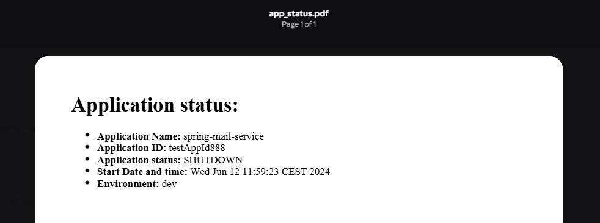

 ## spring-mail-service

This Spring Boot application integrates the JavaMail API to manage sending emails through SMTP servers.

How to **run** service on local:

- Clone the repository.
- Configure SMTP server details in the application.properties file. Change username and password explained here
   [SPRING_BOOT_MAIL.md
  ](https://github.com/misidev/email_sending_SpringBootApp/blob/main/SPRING_BOOT_MAIL.md)

- Configure java 18 SDK and apache-maven-3.9.6
- Run the Spring Boot application.
- Import postman collection with example of endpoints in
  Postman [api-examples/spring-mail-service.postman_collection.json
  ](api-examples/spring-mail-service.postman_collection.json)
- Start managing emails programmatically within your application using endpoints!

## Endpoints in spring-mail-service

### 1. Send Simple Email
This SendEmailWithoutAttachmentController handles requests related to sending emails without attachment.

- **URL**: `/api/v1/mail/sendSimpleEmail`
- **Method**: POST
- **Description**: Sends a simple email to the specified user.
- **Response**:
    - Returns an `EmailResponse` object containing details of the sent email.
    - Returns an `Error Response`: Throws `MailAuthenticationException`, `MailParseException` or `MailPreparationException` if there are issues with sending the email.

- **Example Request**:
  ```bash
  curl -X POST "http://localhost:8088/api/v1/mail/sendSimpleEmail?user=testserviceuser888@yahoo.com"

- **Example Response**:

  ```json
  {
    "status": "success",
    "code": "OK",
    "data": {
        "toEmail": [
            "[testserviceuser888@yahoo.com]"
        ],
        "subject": "User notification",
        "body": "Post request for user is triggered!",
        "file": null
    },
    "message": "POST REQUEST simple email."
  }
  ```
- **Example email**:

  


### 2. Send Email with Attachment
This SendEmailWithAttachmentController handles requests related to sending emails without attachment.

#### Sending attachment as Multipart type:
- **URL**: `/api/v1/mail/sendEmail`
- **Method**: POST
- **Description**: Sends a simple email to the specified user.
- **Request Parameters**:
  - `user` (required): The email address of the recipient.
  - `subject` (required): The subject of the email.
  - `body` (required): The body of the email.
  - `attachments` (required): The attachments - multipart type.
- **Response**:
  - Returns an `EmailResponse` object containing details of the sent email.
  - Returns an `Error Response`: Throws `IOException` or `MessagingException` if there are issues with sending the email.

- **Example Request**:
  ```bash
  curl -X POST "http://localhost:8088/api/v1/mail/sendEmail?user=testserviceuser888@yahoo.com&subject=Sending attachment&body=Sending attachment"

- **Example Response**:

  ```json
  {
    "status": "success",
    "code": "OK",
    "data": {
        "toEmail": [
            "[testserviceuser888@yahoo.com]"
        ],
        "subject": "Sending attachment",
        "body": "Sending attachment",
        "file": "misidev_logo.png"
    },
    "message": "POST REQUEST email with attachment."
  }
  ```
- **Example email**:

  


#### Sending attachment path as String type:
- **URL**: `/api/v1/mail/sendEmailWithAttachment`
- **Method**: POST
- **Description**: Sends an email with an attachment to the specified user.
- **Request Parameters**:
    - `user` (required): The email address of the recipient.
    - `user` (required): The email address of the recipient.
    - `subject` (required): The subject of the email.
    - `body` (required): The body of the email.
- **Response**:
    - **Success Response**: Returns an `EmailResponse` object containing details of the sent email.
    - **Error Response**: Throws `MessagingException` or `IOException` if there are issues with sending the email.
- **Example Request**:
  ```bash
  curl -X POST "http://localhost:8088/api/v1/mail/sendEmailWithAttachment?user=testserviceuser888@yahoo.com&subject=User notification with attachment&body=Post request for user with attachment is triggered!&file=src/main/resources/images/misidev_logo.png"

- **Example Response**:

  ```json
  {
    "status": "success",
    "code": "OK",
    "data": {
        "toEmail": [
            "testserviceuser888@yahoo.com"
        ],
        "subject": "User notification with attachment",
        "body": "Post request for user with attachment is triggered!",
        "file": "src/main/resources/images/misidev_logo.png"
    },
    "message": "POST REQUEST email with attachment."
  }
  ```
- **Example email**:

  

### 3. Send Emails with template 
This SendEmailTemplateController handles requests related to sending emails with templates.

####  Notify on Application Start

This method sends an email notification when the application starts running.

- **Event**: `ApplicationReadyEvent`
- **Listener Method**:
  ```java
  triggerMail()
- **URL**: `/api/v1/mail/sendAppStartEmail`
- **Method**: POST
- **Description**: Sends an email with an attachment to the specified users defined in app.
- **Request Parameters**:
  none
- **Response**:
  - **Success Response**: Returns an `EmailResponse` object containing details of the sent email.
  - **Error Response**: Throws `IOException`, `DocumentException` or `MessagingException` if there are issues with sending the email.
- **Example Request**:
  ```bash
  curl -X POST "http://localhost:8088/api/v1/mail/sendAppStartEmail"

- **Example Response**:

  ```json
  {
    "status": "success",
    "code": "OK",
    "data": {
        "toEmail": [
            "test.service.user888@gmail.com"
        ],
        "subject": "App is started",
        "body": "App is successfully started!",
        "file": "src/main/resources/images/misidev_signature.png"
    },
    "message": "Email to notify that the application has started running"
  }
  ```

- **Example email**:
  
  
  

####  Notify on Application Shutdown
This method sends an email notification when the application starts to shut down.
- **Method**: `@PreDestroy` annotated method
- **Shutdown Hook**:
  ```java
  triggerMailOnShutdown()
- **URL**: `/api/v1/mail/sendShutdownEmail`
- **Method**: POST
- **Description**: Sends an email with an attachment to the specified users defined in app.
- **Request Parameters**:
  none
- **Response**:
  - **Success Response**: Returns an `EmailResponse` object containing details of the sent email.
  - **Error Response**: Throws `IOException`, `DocumentException` or `MessagingException` if there are issues with sending the email.
- **Example Request**:
  ```bash
  curl -X POST "http://localhost:8088/api/v1/mail/sendShutdownEmail"

- **Example Response**:

  ```json
  {
    "status": "success",
    "code": "OK",
    "data": {
        "toEmail": [
            "test.service.user888@gmail.com"
        ],
        "subject": "App is shutting down!",
        "body": "Shutdown of the app started!",
        "file": "src/main/resources/images/misidev_signature.png"
    },
    "message": "Email to notify that the application has started to shut down"
  }
  ```

- **Example email**:
  
  
  

####  Send email with template - Knowledge Transfer
This method sends an email with template for Knowledge Transfer.

- **URL**: `/api/v1/mail/sendEmailTemplate`
- **Method**: POST
- **Description**: Sends an email with template for Knowledge Transfer.
- **Request Parameters**:
  EmailRequest
- **Response**:
  - **Success Response**: Returns an `EmailTemplateResponse` object containing details of the sent email.
  - **Error Response**: Throws `IIOException` or `MessagingException` if there are issues with sending the email.
- **Example Request**:
  ```bash
  curl -X POST "http://localhost:8088/api/v1/mail/sendEmailTemplate"
- **Example EmailRequest**:
  ```json
  {
    "toEmail":["testserviceuser888@yahoo.com"],
    "subject":"Knowledge Transfer",
    "eventName":"Mastering Email Communication: Exploring the JavaMail API",
    "eventDate":"8. July 2024",
    "eventTime":"11:00",
    "eventLocation":"Online",
    "eventRegistrationLink":"event_registration_link.com",
    "recipientName":"Alex",
    "companyName":"misidev",
    "yourName":"Milica",
    "yourJobTitle":"Software Engineer",
    "signature":"src/main/resources/images/misidev_signature.png"
  }
   ```
- **Example Response**:

  ```json
  {
    "status": "success",
    "code": "OK",
    "data": {
        "toEmail": [
            "testserviceuser888@yahoo.com"
        ],
        "subject": "Knowledge Transfer",
        "eventName": "Mastering Email Communication: Exploring the JavaMail API",
        "eventDate": "8. July 2024",
        "eventTime": "11:00",
        "eventLocation": "Online",
        "eventRegistrationLink": "event_registration_link.com",
        "recipientName": "Alex",
        "companyName": "misidev",
        "yourName": "Milica",
        "yourJobTitle": "Software Engineer",
        "signature": "src/main/resources/images/misidev_signature.png"
    },
    "message": "POST REQUEST simple email."
  }
  ```

- **Example email**:
  

### 4. Get Emails
This GetAllEmailsController handles requests related to adding user in db and getting all users from db.

####  Get all emails from DB

- **URL**: `/api/v1/mail/emails/all`
- **Method**: GET
- **Description**: Get all emails from DB.
- **Response**:
  - Returns an `EmailResponse` object containing details of all emails.
- **Example Request**:
  ```bash
  curl -X GET "http://localhost:8088/api/v1/mail/emails/all"

- **Example Response**:

  ```json
   [
     {
     "id": 1,
     "sender": "sieric215@gmail.com",
     "recipient": "test.service.user888@gmail.com",
     "subject": "App is started",
     "body": "email_app_status.html",
     "timestamp": "2024-06-12T15:29:23.962902"
     },
     {
     "id": 2,
      "sender": "sieric215@gmail.com",
      "recipient": "testserviceuser888@yahoo.com",
      "subject": "App is started",
      "body": "email_app_status.html",
      "timestamp": "2024-06-12T15:29:26.764493"
      },
      {
      "id": 3,
      "sender": "sieric215@gmail.com",
      "recipient": "testserviceuser888@yahoo.com",
      "subject": "Knowledge Transfer",
      "body": "email_template.html",
      "timestamp": "2024-06-12T15:29:44.975113"
      }
   ]
  ```

### 5. Add/Get Users
This GetAllEmailsController handles requests related to adding user in db and getting all users from db.

####  Add user in DB
- **URL**: `/api/v1/mail/users/add`
- **Method**: POST
- **Description**: Add user in DB.
- **Response**:
  - Returns an `UserResponse` object containing details of added user in DB.
- **Example Request**:
  ```bash
  curl -X GET "http://localhost:8088/api/v1/mail/users/add"

- **Example Response**:

  ```json
  {
    "status": "success",
    "code": "OK",
    "user": {
        "id": 3,
        "username": "Alex",
        "email": "test.service.user888@gmail.com"
    },
    "message": "POST REQUEST for add user."
  }
  ```

####  GET all users from DB 
- **URL**: `/api/v1/mail/users/all`
- **Method**: GET
- **Description**: GET all users from DB.
- **Response**:
  - Returns an `UsersResponse` object containing details of all users.
- **Example Request**:
  ```bash
  curl -X GET "http://localhost:8088/api/v1/mail/users/all"

- **Example Response**:

  ```json
  {
    "status": "success",
    "code": "OK",
    "user": [
        {
            "id": 1,
            "username": "Alex",
            "email": "test.service.user888@gmail.com"
        },
        {
            "id": 2,
            "username": "Alex",
            "email": "testserviceuser888@yahoo.com"
        }
    ],
    "message": "GET REQUEST for get all users."
  }
  ```


#### Example of one ErrorResponse for all endpoints

  ```json
     {
       "error": {
       "status": "failure",
       "code": 500,
       "message": "Internal Server Error",
       "details": "An unexpected error occurred while processing your request, caused by exception: MailConnectException"
       }
    }
  ```

#### Example of logs for 200 OK 
  ```
2024-06-17T16:35:11.182+02:00  INFO 4464 --- [spring-mail-service] [nio-8088-exec-1] c.e.e.util.HandleDbInputAndResponses     : File app_status.pdf is generated on path src/main/resources/static/app_status.pdf
2024-06-17T16:35:11.182+02:00  INFO 4464 --- [spring-mail-service] [nio-8088-exec-1] c.e.e.aspect.LoggingAspect               : Execution time of class: HandleDbInputAndResponses and method: generatePdf  :: 26 ms
2024-06-17T16:35:13.902+02:00  INFO 4464 --- [spring-mail-service] [nio-8088-exec-1] c.e.e.util.HandleDbInputAndResponses     : Email response for /sendAppStartEmail endpoint - 200 OK: EmailTemplateResponse{status='success', code=200 OK, data=EmailData{toEmail=[testserviceuser888@yahoo.com, test.service.user888@gmail.com], subject='App is started', body='App is successfully started!', file='src/main/resources/images/misidev_signature.png'}, message='Email to notify that the application has started running'}
2024-06-17T16:35:13.902+02:00  INFO 4464 --- [spring-mail-service] [nio-8088-exec-1] c.e.e.aspect.LoggingAspect               : Execution time of class: HandleDbInputAndResponses and method: handleSuccessResponseAppStarts  :: 0 ms
2024-06-17T16:35:13.902+02:00  INFO 4464 --- [spring-mail-service] [nio-8088-exec-1] c.e.e.impl.EmailSenderServiceImpl        : Email with attachment is sent from user: sieric215@gmail.com to test.service.user888@gmail.com
Hibernate: insert into email (body,recipient,sender,subject,timestamp,id) values (?,?,?,?,?,default)
2024-06-17T16:35:13.906+02:00  INFO 4464 --- [spring-mail-service] [nio-8088-exec-1] c.e.e.aspect.LoggingAspect               : Execution time of class: CrudRepository and method: save  :: 3 ms
2024-06-17T16:35:13.906+02:00  INFO 4464 --- [spring-mail-service] [nio-8088-exec-1] c.e.e.util.HandleDbInputAndResponses     : Email with attachment is added in db | toEmail test.service.user888@gmail.com, subject App is started, body email_app_status.html and sender sieric215@gmail.com
2024-06-17T16:35:13.907+02:00  INFO 4464 --- [spring-mail-service] [nio-8088-exec-1] c.e.e.aspect.LoggingAspect               : Execution time of class: HandleDbInputAndResponses and method: saveEmail  :: 4 ms
2024-06-17T16:35:13.907+02:00  INFO 4464 --- [spring-mail-service] [nio-8088-exec-1] c.e.e.aspect.LoggingAspect               : Execution time of class: EmailSenderServiceImpl and method: sendEmailsAppStartsShutdown  :: 5945 ms
2024-06-17T16:35:13.907+02:00  INFO 4464 --- [spring-mail-service] [nio-8088-exec-1] c.e.e.c.SendEmailTemplateController      : Email to notify that the application has started running
2024-06-17T16:35:13.907+02:00  INFO 4464 --- [spring-mail-service] [nio-8088-exec-1] c.e.e.aspect.LoggingAspect               : Execution time of class: SendEmailTemplateController and method: triggerMail  :: 5945 ms
  ```
#### Example of error logs 
```
2024-06-17T16:30:30.671+02:00  INFO 448 --- [spring-mail-service] [nio-8088-exec-2] c.e.e.util.HandleDbInputAndResponses     : File app_status.pdf is generated on path src/main/resources/static/app_status.pdf
2024-06-17T16:30:30.672+02:00  INFO 448 --- [spring-mail-service] [nio-8088-exec-2] c.e.e.aspect.LoggingAspect               : Execution time of class: HandleDbInputAndResponses and method: generatePdf  :: 2136 ms
2024-06-17T16:30:34.566+02:00  INFO 448 --- [spring-mail-service] [nio-8088-exec-2] c.e.e.advice.GlobalExceptionHandler      : "Error caused by exception : MailAuthenticationException", Status code of exception : 401 UNAUTHORIZED"
2024-06-17T16:30:34.769+02:00  INFO 448 --- [spring-mail-service] [nio-8088-exec-2] c.e.e.util.HandleDbInputAndResponses     : Error response for 401 Unauthorized: ErrorResponse{error=Error{status='failure', code=401, message='Unauthorized', details='You are not authorized to access this resource, caused by exception: MailAuthenticationException'}}
2024-06-17T16:30:34.791+02:00  INFO 448 --- [spring-mail-service] [nio-8088-exec-2] c.e.e.aspect.LoggingAspect               : Execution time of class: HandleDbInputAndResponses and method: handleUnauthorized  :: 125 ms
2024-06-17T16:30:34.792+02:00  INFO 448 --- [spring-mail-service] [nio-8088-exec-2] c.e.e.aspect.LoggingAspect               : Execution time of class: GlobalExceptionHandler and method: handleMailAuthenticationException  :: 229 ms
```

#### JUnit Tests 

| Test Type | Class, % | Method, % | Line, % |
|-----------|----------|-----------|---------|
| Small     | 92       | 65        | 64      |
| Medium    |          |           |         |

<span style="color:red">Issue running whole package with coverage - Medium tests! fix in progress!</span>


PLANED IMPROVEMENT:
 - Update JUnit test to increase line coverage (Add invalid small/medium tests for all packages and add missing valid small tests for service package),
 - Enhance the saving of emails in the database to include the template content,
 - Enhance the DB using Liquibase, add constraints, indexes, and improve exception handling related to DB,
 - Handle validation for input data for adding email or user in DB,
 - Add more user information in user profile (check if users table from myappService (user registration/login) can be connected with users table from spring-mail-service or call GET to myapp service and retrieve users data),
 - Implement Lombok.
 - Sending translated emails
 - Add rate limiting configuration in config for spring_cloud_getaway instead bucket4j config
 - Change documentation - OpenAPI(Swagger)
 - Create UI for sending email - choosing email template, users to send email, subject,etc. (connect to myapp frontend?)

Feel free to add "Issues" with improvement ideas!
